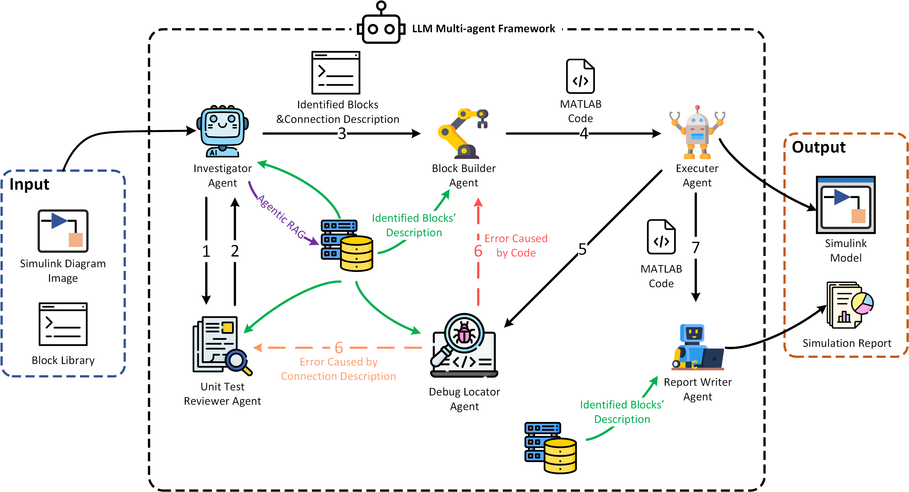

# **SimuGen: Scalable, Accurate Simulink Simulation Generation via Multi-Agent Large Language Models**



## Overview

Recent advances in Large Language Models (LLMs) have shown impressive abilities in mathematical reasoning and code generation. However, LLMs still face significant challenges in the simulation domain—particularly when generating Simulink models, which are critical in engineering and scientific research. Our preliminary experiments indicate that LLM agents alone often struggle to produce reliable and complete Simulink simulation code from textual inputs, likely due to the scarcity of Simulink-specific data in their pre-training corpora.

**SimuGen** bridges this gap with a multi-modal agentic framework that automatically generates accurate Simulink simulation code by leveraging both visual Simulink diagrams and domain knowledge. SimuGen coordinates multiple specialized agents—including an Investigator, Unit Test Reviewer, Block Builder, Executor, Debug Locator, and Report Writer—supported by a domain-specific block database. This collaborative, modular architecture enables robust, interpretable, and extensible Simulink simulation generation.

---

## Framework Overview

The SimuGen pipeline includes the following agents:

* **Investigator**: Uses multimodal LLMs to extract block and connection relationships from Simulink diagram images.
* **Unit Test Reviewer**: Validates whether all blocks and connections conform to Simulink standards.
* **Block Builder**: Converts block and connection descriptions into executable Python code with `matlab.engine`.
* **Executor**: Runs the generated code and reports execution results.
* **Debug Locator**: Diagnoses errors and provides targeted feedback for code or connection revision.
* **Report Writer**: Compiles a comprehensive simulation report, including theoretical context and implementation details.
* **Block Database**: Supplies agents with structured, domain-specific knowledge for accurate code synthesis.

---

## Model Selection & Configuration

SimuGen allows users to flexibly choose the LLM backend and simulation configuration via the `autosim_config.yaml` file. This configuration file enables you to:

* Specify the preferred LLM model or agent configuration.
* Adjust other system parameters as needed.

---

## Environment Setup

To quickly set up the required environment, use the provided `environment.yml` file with Conda.
This will ensure all dependencies are installed for SimuGen.

```bash
conda env create -f environment.yml -n simugen
```

* `-f environment.yml` specifies the environment file.
* `-n simugen` sets the new environment’s name to **simugen**.
  (This name will be used regardless of the `name:` field in `environment.yml`.)

Activate the environment:

```bash
conda activate simugen
```

Now you are ready to run SimuGen!
If you encounter any dependency installation issues, please copy the error and ask for help.

---

## How to Run

To generate a Simulink simulation example, simply run:

```bash
python run.py --example_name <example_name>
```

where `<example_name>` can be one of the following:

* `artificial_algebraic_loops`
* `BipolarTransistor`
* `bouncing_ball`
* `RCCircuit`
* `simulink_model`
* `state_event`
* `two_bus`
* `wheel_speed`
* `zero_crossing_detection`

Example:

```bash
python run.py --example_name bouncing_ball
```

You can configure the model and other parameters in `autosim_config.yaml` before running.

---

## Notes

* Ensure you have correctly set up your Python and MATLAB environments (including `matlab.engine`).
* For best results, avoid adding `.ipynb_checkpoints`, `.env`, or any sensitive files to version control.

---


